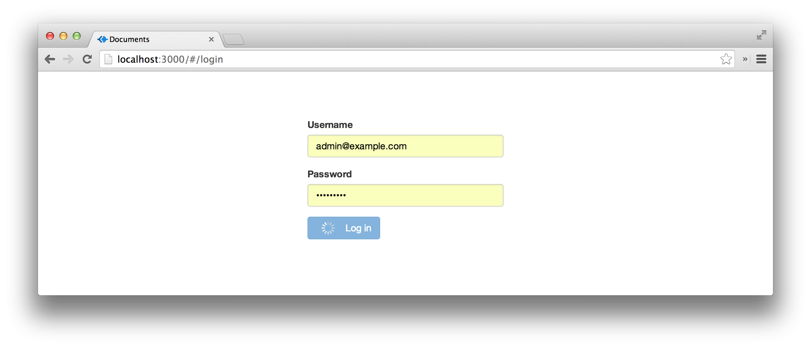

resume-builder
==============

Bootstrap/EmberJS/MongoDB demo.

Libraries:

 * Ember, Ember-Data and lodash for client-side application,
 * Ember-QUnit adn testem for unit tests,
 * Bootstrap, Font-Awesome, Bootstrap-Markdown and Ladda for UI,
 * NodeJS, Express, Mongoose and MongoDB for backend.

### Getting started

	npm install
	bower install
	grunt test # runs unit tests in terminal
	grunt build # compiles client-side scripts and styles
	grunt watchClient # refresh client-side scripts
	npm run-script nodemon # start app server
	
To run tests in browser:

	node_modules/.bin/testem 

### Screenshots

Login:

List of documents with paging and filtering:

Document with markdown-preview and comments:

List of users:

